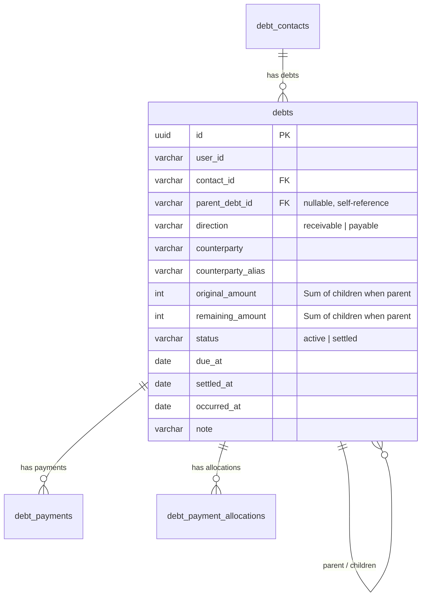

# Kế hoạch Triển khai: Gom/Gộp Khoản Nợ thành Khoản Cha–Con (Debt Consolidation & Parent–Child Hierarchy)

## 1. Tổng quan & Mục tiêu

Hiện tại, người dùng có thể có nhiều khoản nợ đơn lẻ phát sinh với cùng một đối tác (hoặc phát sinh trong các đợt khác nhau). Khi người dùng muốn quản lý gọn gàng hơn hoặc khi thực hiện gộp liên hệ / gộp công nợ, hệ thống cần hỗ trợ **Gom/Gộp các khoản nợ (A, B) thành một khoản nợ cha (C)**:
- Khoản nợ cha **C** đại diện cho tổng nợ gốc (`originalAmount = sum(A, B)`) và tổng nợ còn lại (`remainingAmount = sum(A, B)`).
- Các khoản nợ thành phần **A** và **B** trở thành các khoản con (`parentDebtId = C.id`), giữ nguyên chi tiết ngày phát sinh, ghi chú và lịch sử thanh toán ban đầu để bảo toàn 100% tính minh bạch và truy vết lịch sử.
- Hỗ trợ cho cả 2 chiều công nợ: Khoản **cho vay / phải thu** (`receivable`) và Khoản **đi vay / phải trả** (`payable`).

---

## 2. Thiết kế Kiến trúc Kỹ thuật



---

## 3. Chi tiết Thay đổi Dự kiến

### 3.1. Gói Hợp đồng Dùng chung (`packages/contracts`)
- **API Routes**:
  - `API_ROUTES.debtsCombine`: `'/api/debts/combine'`
- **DTOs & Interfaces**:
  - `ICombineDebtsRequest`:
    ```ts
    export interface ICombineDebtsRequest {
      debtIds: string[];
      counterparty?: string;
      counterpartyAlias?: string;
      contactId?: string;
      note?: string;
      dueAt?: string;
    }
    ```
  - `ICombineDebtsResponse`:
    ```ts
    export interface ICombineDebtsResponse {
      parentDebt: IDebtListItem;
      mergedDebtsCount: number;
    }
    ```
  - Cập nhật `IDebtListItem`:
    ```ts
    export interface IDebtListItem {
      ...
      parentDebtId?: string;
      children?: IDebtListItem[];
      childCount?: number;
    }
    ```
  - Cập nhật `ICombineContactsRequest` bổ sung `consolidateDebts?: boolean`.
- **Đa ngôn ngữ (i18n)**:
  - Bổ sung translation keys cho `vi` và `en`:
    - `debts.actions.combine`: `'Gộp khoản nợ ({count})'` / `'Combine Debts ({count})'`
    - `debts.combineModal.title`: `'Gộp các khoản công nợ'` / `'Combine Debt Records'`
    - `debts.combineModal.desc`: `'Tạo một khoản nợ cha tổng hợp từ các khoản nợ đã chọn'` / `'Create a consolidated parent debt from selected records'`
    - `debts.combineModal.parentNote`: `'Ghi chú khoản nợ gộp'` / `'Consolidated Debt Note'`
    - `debts.combineModal.warning`: `'Các khoản nợ đã chọn sẽ trở thành khoản con thuộc khoản nợ tổng hợp này.'` / `'Selected debts will become child items under this consolidated debt.'`
    - `debts.combineModal.mismatchedDirection`: `'Chỉ có thể gộp các khoản nợ cùng chiều (cùng Phải thu hoặc cùng Phải trả).'` / `'Can only combine debts of the same direction.'`
    - `debts.combine.success`: `'Đã gộp thành công {count} khoản nợ'` / `'Successfully combined {count} debts'`
    - `debts.badge.parent`: `'Khoản gộp ({count})'` / `'Consolidated ({count})'`
    - `debts.badge.child`: `'Khoản con'` / `'Sub-debt'`
    - `contacts.combineModal.consolidateDebtsLabel`: `'Gộp các khoản nợ cùng chiều thành một khoản cha'` / `'Consolidate debts of the same direction into parent debts'`

---

### 3.2. Cơ sở Dữ liệu & TypeORM (`apps/api`)
- **Entity `DebtEntity`**:
  - Thêm trường `parentDebtId?: string` (cột `parent_debt_id`, nullable).
  - Thêm quan hệ `@ManyToOne(() => DebtEntity, (d) => d.children, { nullable: true, onDelete: 'SET NULL' })` kèm `@JoinColumn({ name: 'parent_debt_id' }) parentDebt?: DebtEntity`.
  - Thêm quan hệ `@OneToMany(() => DebtEntity, (d) => d.parentDebt) children?: DebtEntity[]`.
- **Migration**:
  - Tạo file migration TypeORM `1724680000000-AddParentDebtHierarchy.ts` thêm cột `parent_debt_id VARCHAR NULL REFERENCES debts(id) ON DELETE SET NULL` và tạo index trên `parent_debt_id`.

---

### 3.3. Nghiệp vụ Backend (`FinanceService` & `FinanceController`)
- **`FinanceService.combineDebts(userId, input: ICombineDebtsRequest)`**:
  - Kiểm tra `debtIds.length >= 2`.
  - Tìm nạp danh sách debts của user theo `debtIds`.
  - Kiểm tra tính đồng nhất chiều: Mọi khoản nợ được chọn bắt buộc phải cùng `direction` (`receivable` hoặc `payable`).
  - Kiểm tra chống lặp/vòng lặp (không chọn khoản đã là cha của khoản khác trong danh sách).
  - Tính tổng `originalAmount = sum(child.originalAmount)` và `remainingAmount = sum(child.remainingAmount)`.
  - Trong `manager.transaction(...)`:
    - Tạo `parentDebt` mới với `originalAmount`, `remainingAmount`, `direction`, `contactId`, `counterparty`, `counterpartyAlias`, `dueAt`, `note`, `status` (`remainingAmount === 0 ? 'settled' : 'active'`), `occurredAt` (mốc thời gian phát sinh gần nhất của các khoản con).
    - Cập nhật các khoản con: gán `parentDebtId = parentDebt.id`.
    - Lưu toàn bộ thay đổi.
- **`FinanceService.combineContacts`**:
  - Nếu `input.consolidateDebts === true`:
    - Tự động gom các khoản nợ `receivable` thành 1 parent receivable debt.
    - Tự động gom các khoản nợ `payable` thành 1 parent payable debt.
- **`FinanceService.listDebts`**:
  - Hỗ trợ nạp phân cấp: Nạp các khoản nợ gốc (`parentDebtId IS NULL`) kèm `children` và `payments`.
- **`FinanceController`**:
  - Bổ sung endpoint `POST /api/debts/combine`.
- **Unit Tests (`finance.service.spec.ts`)**:
  - Test gộp nợ thành công tạo parent debt đúng số tiền gốc và số dư còn lại.
  - Test từ chối khi gộp khác chiều (`receivable` lẫn `payable`).
  - Test tự động gom nợ khi gộp danh bạ liên hệ (`consolidateDebts: true`).

---

### 3.4. Web Frontend (`apps/web`)
- **API & Query**:
  - `apps/web/src/modules/debts/api/debts-api.ts`: Thêm hàm `combineDebts(input, signal)`.
  - `apps/web/src/modules/debts/api/debts-query.ts`: Thêm hook `useCombineDebtsMutation()`.
- **Modal Dialog `CombineDebtsDialog`**:
  - Tạo `apps/web/src/modules/debts/presentation/components/combine-debts-dialog.tsx`.
  - Hiển thị bảng tóm tắt các khoản nợ được chọn (Nợ gốc, Còn lại, Người liên quan, Ghi chú).
  - Kiểm tra nếu có khoản nợ khác chiều -> Hiển thị cảnh báo lỗi và vô hiệu hóa nút Xác nhận.
  - Cho phép nhập/chỉnh sửa ghi chú và ngày hẹn trả của khoản nợ cha.
  - Hiển thị tổng tiền nợ gốc và tổng tiền còn lại của khoản nợ cha.
- **Bảng Công Nợ (`DebtsScreen` & `DebtsTable`)**:
  - Bổ sung ô checkbox chọn dòng (multi-select) trên từng khoản nợ.
  - Thanh công cụ hành động xuất hiện khi chọn từ 2 khoản nợ trở lên: Nút **"Gộp khoản nợ ({count})"**.
  - Hiển thị cấu trúc phân cấp (Hierarchical Tree/Sub-rows):
    - Khoản nợ cha có nút mở rộng/thu gọn (`▶ / ▼`) và badge `[Khoản gộp: N khoản con]`.
    - Khi bấm mở rộng, hiển thị các dòng con thụt lề bên dưới với chi tiết từng khoản ban đầu.
- **Modal Gộp Liên Hệ (`CombineContactsDialog`)**:
  - Bổ sung tùy chọn checkbox: *"Gộp các khoản nợ cùng chiều thành một khoản nợ cha"* (`consolidateDebts: true`).

---

### 3.5. Đồng bộ Tài liệu Tri thức Hệ thống
- **Canonical Knowledge (English)**: Cập nhật `.agents/knowledge/modules/debts/README.md` về cấu trúc phân cấp cha–con và API combine debts.
- **Developer Documentation (Vietnamese)**: Cập nhật `.agents/docs/modules/debts/README.md`.

---

## 4. Kế hoạch Kiểm thử & Xác minh

### Automated Tests
1. `npm run typecheck` (Kiểm tra kiểu dữ liệu toàn bộ monorepo).
2. `npm run lint` (Kiểm tra quy chuẩn mã nguồn ESLint).
3. `npm run test --workspace=@telebot/api` (Chạy toàn bộ unit test suite NestJS bao gồm test cases mới cho combine debts).
4. `npm run build --workspace=@telebot/web` (Kiểm tra build tĩnh Next.js production).
5. `npm run agent-system:validate` (Kiểm tra tính toàn vẹn của hệ thống agent & docs).

### Manual Verification
1. Mở trang **Vay & Cho vay** (`/debts`), tích chọn 2 khoản cho vay của một người hoặc nhiều người.
2. Bấm nút **Gộp khoản nợ (2)**, kiểm tra modal tính tổng số tiền nợ gốc và nợ còn lại chính xác.
3. Xác nhận gộp, kiểm tra xuất hiện khoản nợ cha với badge khoản gộp và có thể bấm mở rộng xem 2 khoản con.
4. Mở trang **Người liên quan** (`/contacts`), tích chọn 2 liên hệ và bật tùy chọn gộp công nợ cha–con.

---

> [!IMPORTANT]
> **Quy tắc Kiểm duyệt Kế hoạch (Planning Phase Gate)**:
> Theo quy chuẩn phát triển nghiêm ngặt 2 pha, Agent sẽ tạm dừng tại đây để xin ý kiến phản hồi và phê duyệt từ bạn trước khi tiến hành chỉnh sửa mã nguồn.
