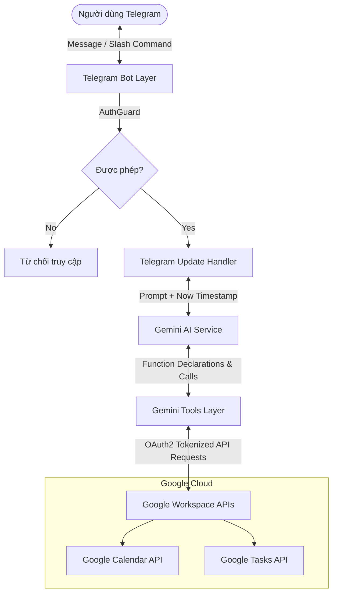
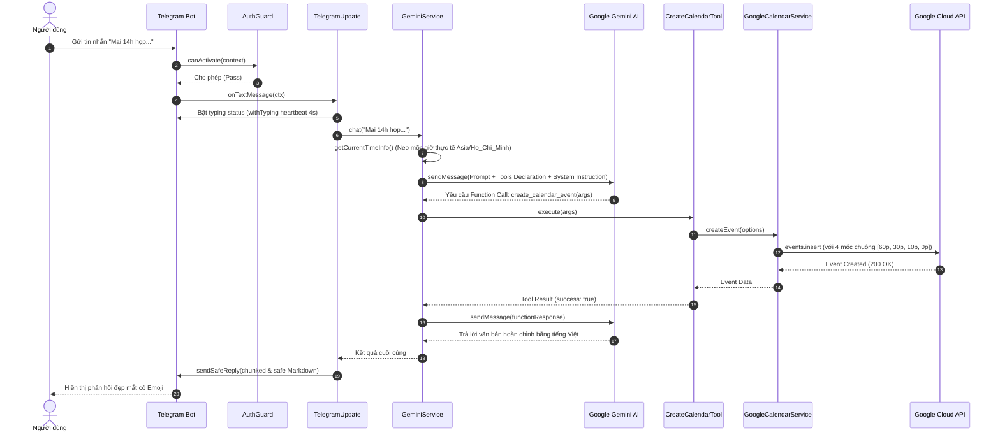

# 🏛️ Kiến Trúc Hệ Thống (System Architecture)

Tài liệu này mô tả chi tiết kiến trúc tổng thể, luồng dữ liệu và các nguyên lý thiết kế cốt lõi của **NestJS Telegram AI Assistant**.

---

## 1. Bức Tranh Tổng Thể (High-Level Overview)

Dự án được xây dựng theo mô hình **Modular Monolith** trên nền tảng **NestJS**, kết nối 3 thực thể chính:
1. **Người dùng Telegram**: Gửi yêu cầu bằng ngôn ngữ tự nhiên tiếng Việt hoặc qua các lệnh tắt (Slash Commands).
2. **Bộ não Google Gemini AI (`gemini-3.5-flash`)**: Phân tích ngữ cảnh, suy luận mốc thời gian và quyết định gọi công cụ (Function Calling).
3. **Google Workspace (Calendar & Tasks)**: Dịch vụ đích thực thi thao tác dữ liệu qua OAuth2.



---

## 2. Cấu Trúc Module NestJS

Hệ thống tuân thủ nghiêm ngặt nguyên lý **Separation of Concerns (SoC)** và **Dependency Injection (DI)** của NestJS:

```text
src/
├── app.module.ts               # Root Module tổng hợp Config, Telegraf, Gemini, Google
├── main.ts                     # Khởi tạo NestJS Context
├── config/
│   └── configuration.ts        # Schema validation cho các biến .env
├── telegram/                   # TẦNG GIAO TIẾP TELEGRAM
│   ├── guards/auth.guard.ts    # Kiểm tra Whitelist Telegram User ID
│   ├── telegram.update.ts      # Xử lý sự kiện tin nhắn & Slash Commands
│   └── telegram.module.ts
├── gemini/                     # TẦNG TRÍ TUỆ NHÂN TẠO (AI CORE)
│   ├── tools/                  # Triển khai các Tool Function Calling
│   │   ├── tool.interface.ts   # Interface chuẩn GeminiTool
│   │   ├── create-calendar.tool.ts
│   │   ├── list-calendar.tool.ts
│   │   ├── delete-calendar.tool.ts
│   │   ├── create-task.tool.ts
│   │   ├── list-tasks.tool.ts
│   │   └── complete-task.tool.ts
│   ├── gemini.service.ts       # Quản lý Session, Fallback Model, Loop Function Call
│   └── gemini.module.ts
└── google/                     # TẦNG GOOGLE WORKSPACE APIS
    ├── google-auth.service.ts  # Quản lý OAuth2, tự động lưu token khi refresh
    ├── google-calendar.service.ts # Calendar API + 4 mốc nhắc nhở dồn dập
    ├── google-tasks.service.ts    # Tasks API (@default tasklist)
    └── google.module.ts
```

---

## 3. Sơ Đồ Luồng Dữ Liệu Chi Tiết (Sequence Flow)

Luồng hoạt động khi người dùng gửi một tin nhắn tự nhiên (Ví dụ: *"Mai 14h họp dự án tại phòng 302 nhé"*):



---

## 4. Các Nguyên Lý Thiết Kế Cốt Lõi (Core Principles)

### 1. Neo Thời Gian Thực Tế (Realtime Timestamp Injection)
- **Vấn đề**: LLM không có đồng hồ nội tại. Khi người dùng nói "ngày mai", "thứ 5 tuần sau", "15 phút nữa", AI thường suy luận sai mốc thời gian.
- **Giải pháp**: Mỗi lượt gọi chat, `GeminiService.getCurrentTimeInfo()` lấy thời gian hệ thống chính xác theo múi giờ `Asia/Ho_Chi_Minh` và chèn vào System Instruction làm mốc quy chiếu chuẩn tuyệt đối.

### 2. Vòng Lặp Function Calling (Multi-turn Tool Loop)
- Gemini có thể cần gọi nhiều tool liên tiếp trước khi ra kết quả cuối cùng (ví dụ: vừa kiểm tra lịch trống vừa tạo lịch mới).
- `GeminiService` cài đặt vòng lặp `while (functionCalls && iterations < MAX_ITERATIONS)` với chặn tối đa 6 bước để xử lý tuần tự và ngăn chặn lặp vô hạn.

### 3. Chuỗi Fallback Model Tự Động (Resilient AI Model Fallback)
- Nhằm đảm bảo bot luôn trực tuyến ngay cả khi một model bị nghẽn (Rate Limit/Quota):
  $$\text{Model chính} \longrightarrow \text{gemini-3.5-flash} \longrightarrow \text{gemini-3.5-flash-lite} \longrightarrow \text{gemini-3.6-flash}$$
- Nếu model đầu tiên gặp sự cố, hệ thống tự động thử model tiếp theo một cách trong suốt đối với người dùng.

### 4. Cơ Chế Multi-Reminder Báo Chuông Dồn Dập
- Khi tạo sự kiện Calendar, `GoogleCalendarService` luôn tự động thiết lập 4 mốc nhắc nhở popup:
  - **60 phút trước**: Chuẩn bị tài liệu, khởi hành.
  - **30 phút trước**: Sắp xếp công việc hiện tại.
  - **10 phút trước**: Đi vào phòng họp / mở link Meet.
  - **0 phút (ngay giờ)**: Bắt đầu sự kiện.

### 5. Giao Diện Người Dùng Thân Thiện & Ổn Định Trên Telegram
- **Typing Heartbeat (`withTyping`)**: Gửi tín hiệu `typing` định kỳ 4 giây một lần để người dùng không cảm thấy bot bị treo khi AI đang xử lý logic phức tạp.
- **Safe Reply (`sendSafeReply`)**: 
  - Tự động chia nhỏ tin nhắn dài vượt quá giới hạn 4000 ký tự của Telegram.
  - Tự động fallback về plain-text nếu cú pháp Markdown bị lỗi ký tự đặc biệt.
