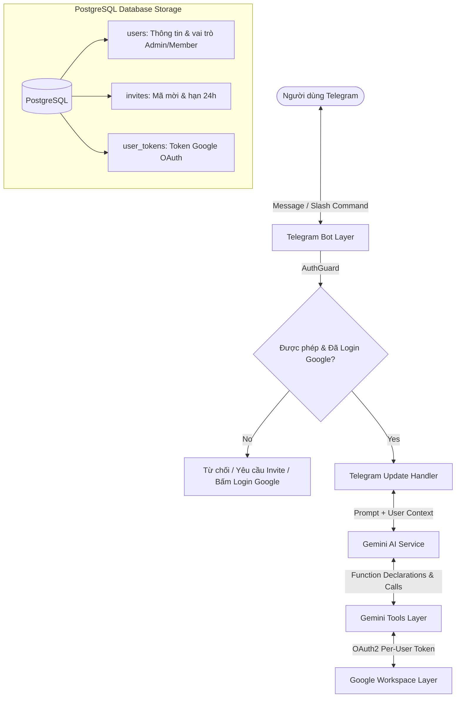

# 🏛️ Kiến Trúc Hệ Thống (System Architecture)

Tài liệu này mô tả chi tiết kiến trúc tổng thể, luồng dữ liệu và các nguyên lý thiết kế cốt lõi của **NestJS Telegram AI Assistant**.

---

## 1. Bức Tranh Tổng Thể (High-Level Overview)

Dự án được tổ chức dưới dạng **npm workspaces monorepo**. Backend là **Modular Monolith NestJS** tại `apps/api`, giao diện quản trị React + Vite tại `apps/web`, và các hợp đồng dùng chung tại `packages/contracts`. Backend hỗ trợ **Kiến trúc Đa Người Dùng (Multi-Tenant Isolation)** với **PostgreSQL (TypeORM)**.

1. **Người dùng Telegram**: Gửi yêu cầu qua ngôn ngữ tự nhiên tiếng Việt hoặc qua các lệnh tắt (Slash Commands).
2. **Tầng Phân Quyền & Quản Lý Người Dùng (`UsersModule` + PostgreSQL)**: Quản lý người dùng, lời mời kích hoạt Deep Link (`/invite`), danh sách trắng động và chống spam qua cơ sở dữ liệu PostgreSQL.
3. **Bộ não Google Gemini AI (`gemini-3.5-flash-lite`)**: Phân tích ngữ cảnh, neo thời gian thực tế, gọi Function Calling đa bước và tự động fallback model.
4. **Google Workspace (Calendar & Tasks)**: Dịch vụ thực thi dữ liệu qua OAuth2 được cô lập độc lập cho từng người dùng (`user_tokens` table).



---

## 2. Cấu Trúc Module NestJS Tách Biệt & Tinh Gọn

Hệ thống tuân thủ nghiêm ngặt nguyên lý **Single Responsibility Principle (SRP)** và **Separation of Concerns (SoC)**:

```text
apps/api/src/
├── app.module.ts                   # Root Module kết nối toàn bộ hệ thống
├── main.ts                         # Entrypoint & Fail-fast Environment Validator
│
├── config/                         # CẤU HÌNH & VALIDATION
│   ├── configuration.ts            # Load & sanitize biến môi trường .env
│   └── env.validator.ts            # Quét và in bảng cảnh báo nếu thiếu biến
│
├── database/                       # TẦNG CƠ SỞ DỮ LIỆU POSTGRESQL (TYPEORM)
│   ├── database.module.ts          # TypeOrmModule (PostgreSQL)
│   └── entities/                   # UserEntity, InviteEntity, UserTokenEntity
│
├── users/                          # TẦNG QUẢN LÝ NGƯỜI DÙNG
│   ├── users.service.ts            # TypeORM Repositories, In-Memory Cache, Cooldown
│   └── users.module.ts
│
├── telegram/                       # TẦNG GIAO TIẾP TELEGRAM
│   ├── services/
│   │   └── telegram-ui.service.ts  # Tách riêng: Typing Heartbeat, Safe Reply Chunking, Code Extraction
│   ├── guards/
│   │   └── auth.guard.ts           # Whitelist Check, Anti-spam & Google Auth Requirement
│   ├── telegram.update.ts          # Điều phối Slash Commands & Text Message Dispatcher
│   └── telegram.module.ts
│
├── gemini/                         # TẦNG TRÍ TUỆ NHÂN TẠO (AI CORE)
│   ├── helpers/
│   │   └── gemini-prompt.helper.ts # Tách riêng: System Instruction, Timestamp Anchor
│   ├── gemini.service.ts           # Multi-turn Tool Loop & Model Fallback Chain
│   ├── gemini.module.ts
│   └── tools/                      # 8 Function Tools độc lập
│
└── google/                         # TẦNG TÍCH HỢP GOOGLE WORKSPACE
    ├── templates/
    │   └── oauth-html.template.ts  # Tách riêng: Giao diện HTML Success / Error UI
    ├── google-auth.controller.ts   # Web OAuth Callback Endpoint (/oauth2callback)
    ├── google-auth.service.ts      # Quản lý OAuth2 per-user trong PostgreSQL
    ├── google-calendar.service.ts  # Tương tác Google Calendar API per-user
    ├── google-tasks.service.ts     # Tương tác Google Tasks API per-user
    └── google.module.ts
```

---

## 3. Các Nguyên Lý Thiết Kế Trọng Yếu

### 1. Zero-File-Mount & Portable Secrets
Toàn bộ thông tin Client ID/Secret được truyền trực tiếp qua biến môi trường; token OAuth được mã hóa và lưu trong PostgreSQL. Không có file token rời rạc giúp triển khai nhanh chóng trên Docker/Coolify.

### 2. Multi-Tenant Token Isolation
Mọi yêu cầu tương tác Google Workspace đều nhận kèm `userId`. `GoogleAuthService` tự động lấy đúng OAuth2Client của người đó từ PostgreSQL, ngăn chặn 100% rủi ro lẫn lộn dữ liệu giữa người dùng.

### 3. Dual-Mode Fallback
Hệ thống vừa hỗ trợ Web Callback tự động 1-click qua HTTP Server, vừa hỗ trợ sao chép đường link dán trực tiếp vào chat Telegram để đảm bảo không bao giờ bị gián đoạn.
