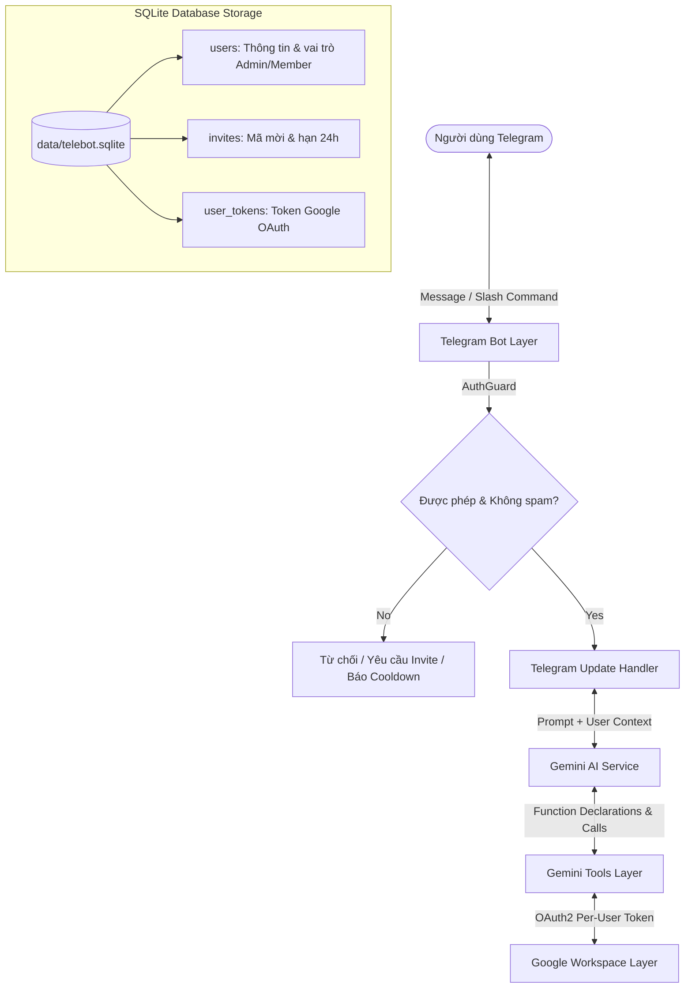

# 🏛️ Kiến Trúc Hệ Thống (System Architecture)

Tài liệu này mô tả chi tiết kiến trúc tổng thể, luồng dữ liệu và các nguyên lý thiết kế cốt lõi của **NestJS Telegram AI Assistant**.

---

## 1. Bức Tranh Tổng Thể (High-Level Overview)

Dự án được xây dựng theo mô hình **Modular Monolith** trên nền tảng **NestJS**, hỗ trợ **Kiến trúc Đa Người Dùng (Multi-Tenant Isolation)** và **Cơ sở dữ liệu nhúng SQLite (TypeORM)** kết nối 4 thực thể chính:

1. **Người dùng Telegram**: Gửi yêu cầu qua ngôn ngữ tự nhiên tiếng Việt hoặc qua các lệnh tắt (Slash Commands).
2. **Tầng Phân Quyền & Quản Lý Người Dùng (`UsersModule` + SQLite)**: Quản lý người dùng, lời mời kích hoạt Deep Link (`/invite`), danh sách trắng động và chống spam qua cơ sở dữ liệu `data/telebot.sqlite`.
3. **Bộ não Google Gemini AI (`gemini-3.5-flash-lite`)**: Phân tích ngữ cảnh, neo thời gian thực tế, gọi Function Calling đa bước và tự động fallback model.
4. **Google Workspace (Calendar & Tasks)**: Dịch vụ thực thi dữ liệu qua OAuth2 được cô lập độc lập cho từng người dùng (`user_tokens` table & `data/tokens/<userId>.json`).



---

## 2. Cấu Trúc Module NestJS

Hệ thống tuân thủ nghiêm ngặt nguyên lý **Separation of Concerns (SoC)** và **Dependency Injection (DI)** của NestJS:

```text
src/
├── app.module.ts               # Root Module kết nối Config, Database, Users, Telegram, Gemini, Google
├── main.ts                     # Khởi tạo NestJS Context
├── config/
│   └── configuration.ts        # Load & validate biến môi trường .env
├── database/                   # TẦNG CƠ SỞ DỮ LIỆU SQLITE (TYPEORM)
│   ├── database.module.ts      # Cấu hình TypeOrmModule với better-sqlite3 (data/telebot.sqlite)
│   └── entities/               # Các bảng cơ sở dữ liệu
│       ├── user.entity.ts      # Bảng users
│       ├── invite.entity.ts    # Bảng invites
│       └── user-token.entity.ts # Bảng user_tokens
├── users/                      # TẦNG QUẢN LÝ NGƯỜI DÙNG
│   ├── users.service.ts        # TypeORM Repositories, In-Memory Cache, Cooldown Limiter
│   └── users.module.ts
├── telegram/                   # TẦNG GIAO TIẾP TELEGRAM
│   ├── guards/auth.guard.ts    # Kiểm tra Whitelist động, Deep-link invite & Cooldown
│   ├── telegram.update.ts      # Xử lý Slash Commands (/invite, /login, /code, /status...)
│   └── telegram.module.ts
├── gemini/                     # TẦNG TRÍ TUỆ NHÂN TẠO (AI CORE)
│   ├── tools/                  # Triển khai các Tool Function Calling (có User Context)
│   │   ├── tool.interface.ts   # Interface chuẩn GeminiTool & ToolExecutionContext
│   │   ├── create-calendar.tool.ts
│   │   ├── list-calendar.tool.ts
│   │   ├── delete-calendar.tool.ts
│   │   ├── create-task.tool.ts
│   │   ├── list-tasks.tool.ts
│   │   └── complete-task.tool.ts
│   ├── gemini.service.ts       # Prompt Injection, Fallback Model Chain, Loop Function Call
│   └── gemini.module.ts
└── google/                     # TẦNG GOOGLE WORKSPACE APIS (MULTI-TENANT)
    ├── google-auth.service.ts  # Quản lý OAuth2 per-user trong SQLite + disk, code exchange
    ├── google-calendar.service.ts # Calendar API per-user + 4 mốc nhắc nhở dồn dập
    ├── google-tasks.service.ts    # Tasks API per-user (@default tasklist)
    └── google.module.ts
```

---

## 3. Các Nguyên Lý Thiết Kế Cốt Lõi (Core Principles)

### 1. Cơ Sở Dữ Liệu SQLite Nhúng (Embedded Database with TypeORM)
- Toàn bộ dữ liệu người dùng, lời mời và token được lưu trong một file duy nhất `data/telebot.sqlite`.
- **Zero Memory Overhead**: Không tốn thêm RAM như các server DB độc lập, nhưng vẫn sở hữu trọn vẹn tính toàn vẹn giao dịch (ACID).
- **In-Memory Cache L1**: Các truy vấn xác thực quyền truy cập (`isAllowed`, `isAdmin`) được cache trong bộ nhớ RAM để đảm bảo độ trễ = 0ms.

### 2. Cô Lập Dữ Liệu Đa Người Dùng (Multi-Tenant Token Isolation)
- Mỗi người dùng có một bản ghi Token Google độc lập trong bảng `user_tokens` và file `data/tokens/<userId>.json`.
- Mọi thao tác đọc/ghi lịch của User A được thực thi với Token của User A, tuyệt đối không truy cập chéo vào dữ liệu của Admin hay người khác.

### 3. Neo Thời Gian Thực Tế (Realtime Timestamp Injection)
- Mỗi lượt gọi chat, `GeminiService.getCurrentTimeInfo()` lấy thời gian hệ thống chính xác theo múi giờ `Asia/Ho_Chi_Minh` và chèn vào System Instruction làm mốc quy chiếu chuẩn tuyệt đối.

### 4. Chuỗi Fallback Model Tự Động (Resilient AI Model Fallback)
- Mặc định sử dụng model `gemini-3.5-flash-lite` với chuỗi dự phòng:
  $$\text{gemini-3.5-flash-lite} \longrightarrow \text{gemini-3.5-flash} \longrightarrow \text{gemini-3.6-flash}$$

### 5. Phòng Thủ Chống Spam & Giữ Kết Nối UX
- **Cooldown Throttling (2s)**: Chống spam gửi liên tiếp.
- **Hàng đợi & Typing Heartbeat**: Giữ kết nối mượt mà trên Telegram.
