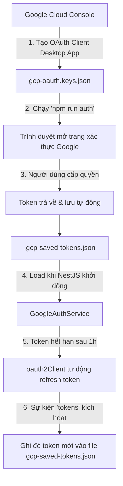

# 📅 Tích Hợp Google Workspace (OAuth2, Calendar & Tasks)

Tài liệu này mô tả chi tiết cách thức xác thực Google OAuth 2.0, kiến trúc các service tích hợp **Google Calendar**, **Google Tasks** và hướng dẫn mở rộng sang các dịch vụ khác của Google Workspace (Gmail, Drive, Sheets...).

---

## 1. Vòng Đời Google OAuth 2.0

Ứng dụng sử dụng luồng xác thực **Google OAuth 2.0 (Desktop App)**, lưu trữ `refresh_token` offline để bot có thể hoạt động 24/7 mà không cần người dùng đăng nhập lại.



### Các File Cấu Hình Quan Trọng:

1. `gcp-oauth.keys.json`: File chứa `client_id` và `client_secret` tải về từ Google Cloud Console.
2. `.gcp-saved-tokens.json`: File lưu `access_token`, `refresh_token`, `expiry_date` sau khi xác thực thành công.

---

## 2. Quản Lý Quyền (Scopes)

Danh sách Scope được khai báo tại [`src/google/google-auth.service.ts`](/src/google/google-auth.service.ts) và [`scripts/auth.ts`](/scripts/auth.ts):

```typescript
export const GOOGLE_SCOPES = [
  'https://www.googleapis.com/auth/calendar',
  'https://www.googleapis.com/auth/tasks',
  // Thêm scope mới tại đây khi mở rộng tính năng
];
```

> [!WARNING]
> Mỗi khi thêm Scope mới, bạn **BẮT BUỘC** phải chạy lại lệnh `npm run auth` trên máy để tài khoản Google cấp thêm quyền cho Token mới.

---

## 3. Dịch Vụ Google Calendar (`GoogleCalendarService`)

File vị trí: [`src/google/google-calendar.service.ts`](/src/google/google-calendar.service.ts).

### Các Tính Năng & Phương Thức Chính:

- `listEvents(options)`: Liệt kê sự kiện trong khoảng thời gian `timeMin` đến `timeMax`, sắp xếp theo `startTime`, hỗ trợ tìm kiếm từ khóa `q`.
- `createEvent(options)`: Tạo sự kiện mới. Mặc định tự động gắn **4 mốc chuông báo Popup**:
  ```typescript
  const reminderMinutes = options.reminderMinutes || [60, 30, 10, 0];
  // 60 phút, 30 phút, 10 phút, 0 phút (đúng giờ)
  ```
- `deleteEvent(eventId)`: Xóa sự kiện theo ID.
- `getEvent(eventId)`: Lấy thông tin chi tiết một sự kiện cụ thể.

### Định Dạng Thời Gian:

- Phải luôn sử dụng chuẩn **ISO 8601** có Offset múi giờ Việt Nam (`+07:00`).
- Ví dụ: `2026-08-23T14:00:00+07:00`.

---

## 4. Dịch Vụ Google Tasks (`GoogleTasksService`)

File vị trí: [`src/google/google-tasks.service.ts`](/src/google/google-tasks.service.ts).

### Các Phương Thức Chính:

- `listTasks(options)`: Lấy danh sách việc cần làm từ tasklist mặc định (`@default`). Hỗ trợ lọc task chưa xong (`showCompleted: false`).
- `createTask(options)`: Tạo task mới với tiêu đề (`title`), ghi chú (`notes`) và hạn chót (`due` theo định dạng RFC 3339).
- `completeTask(taskId)`: Đánh dấu trạng thái `status: 'completed'`.
- `deleteTask(taskId)`: Xóa vĩnh viễn task khỏi danh sách.

---

## 5. Hướng Dẫn Mở Rộng Thêm Dịch Vụ Google Mới

Khi muốn bổ sung **Gmail**, **Google Drive**, **Google Sheets**, thực hiện theo quy trình chuẩn 4 bước:

### Bước 1: Kích hoạt API trên Google Cloud Console

1. Truy cập [Google Cloud Console Library](https://console.cloud.google.com/apis/library).
2. Tìm `Gmail API` (hoặc `Google Drive API`) và nhấn **Enable**.

### Bước 2: Khai báo Scope & Cấp quyền lại

Thêm scope vào `src/google/google-auth.service.ts` và `scripts/auth.ts`:

```typescript
export const GOOGLE_SCOPES = [
  'https://www.googleapis.com/auth/calendar',
  'https://www.googleapis.com/auth/tasks',
  'https://www.googleapis.com/auth/gmail.send', // <-- Thêm Gmail Scope
  'https://www.googleapis.com/auth/drive.readonly', // <-- Thêm Drive Scope
];
```

Chạy xác thực lại trên máy:

```bash
npm run auth
```

### Bước 3: Tạo Service tương tác

Tạo file mới [`src/google/google-gmail.service.ts`](/src/google/google-gmail.service.ts):

```typescript
import { Injectable, Logger } from '@nestjs/common';
import { google, gmail_v1 } from 'googleapis';
import { GoogleAuthService } from './google-auth.service';

@Injectable()
export class GoogleGmailService {
  private readonly logger = new Logger(GoogleGmailService.name);

  constructor(private readonly authService: GoogleAuthService) {}

  private getGmailClient(): gmail_v1.Gmail {
    const auth = this.authService.getOAuth2Client();
    if (!auth || !this.authService.isAuthorized()) {
      throw new Error('Google Gmail chưa được xác thực.');
    }
    return google.gmail({ version: 'v1', auth });
  }

  public async sendEmail(to: string, subject: string, body: string): Promise<boolean> {
    const gmail = this.getGmailClient();

    // Tạo MIME format string UTF-8
    const utf8Subject = `=?utf-8?B?${Buffer.from(subject).toString('base64')}?=`;
    const messageParts = [
      `To: ${to}`,
      'Content-Type: text/html; charset=utf-8',
      'MIME-Version: 1.0',
      `Subject: ${utf8Subject}`,
      '',
      body,
    ];
    const message = messageParts.join('\n');
    const encodedMessage = Buffer.from(message)
      .toString('base64')
      .replace(/\+/g, '-')
      .replace(/\//g, '_')
      .replace(/=+$/, '');

    await gmail.users.messages.send({
      userId: 'me',
      requestBody: { raw: encodedMessage },
    });

    this.logger.log(`Sent email to ${to} successfully`);
    return true;
  }
}
```

### Bước 4: Đăng ký trong `GoogleModule`

Mở [`src/google/google.module.ts`](/src/google/google.module.ts) và thêm service vào mảng `providers` và `exports`. Service này đã sẵn sàng để được inject vào các Tool của Gemini!
