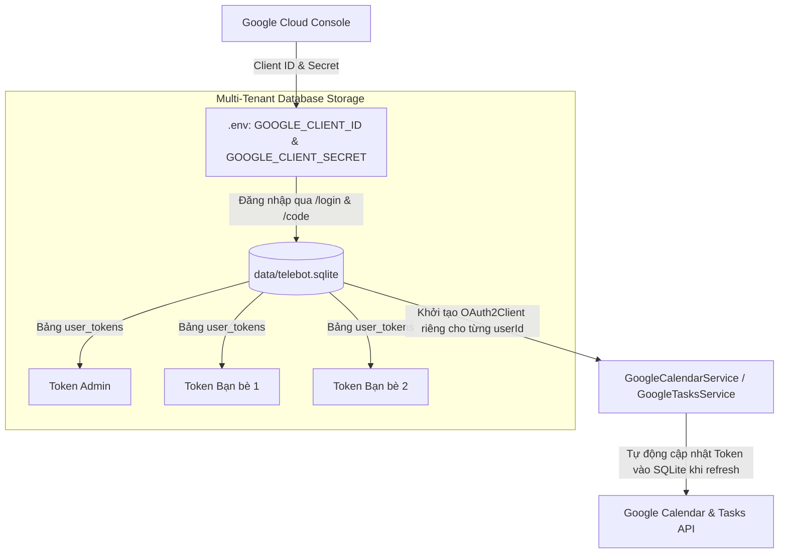

# 📅 Tích Hợp Google Workspace & Quản Lý Token Trong SQLite (OAuth2)

Tài liệu này mô tả chi tiết cách thức xác thực Google OAuth 2.0 theo từng người dùng độc lập, cấu hình Client Credentials qua biến môi trường (Zero-File-Mount) và lưu trữ Token trong **Database SQLite** (`user_tokens`).

---

## 1. Vòng Đời Google OAuth 2.0 & Quản Lý Trong SQLite

Hệ thống sử dụng cơ chế **Zero-File-Mount**:



### Các Biến Môi Trường Cấu Hình:
- `GOOGLE_CLIENT_ID`: Client ID lấy từ Google Cloud Console (OAuth Client ID - Desktop App).
- `GOOGLE_CLIENT_SECRET`: Client Secret tương ứng.

---

## 2. Luồng Đăng Nhập Cho Người Dùng Mới (`/login` & `/code`)

1. Người dùng gõ `/login` hoặc bấm nút **"🔗 Đăng nhập Google"** trên Telegram (hoặc AI tự gọi tool `login_google`).
2. `GoogleAuthService.generateAuthUrl(userId)` sinh URL xác thực Google với tham số `state: userId`.
3. Người dùng đăng nhập Gmail (đã nằm trong danh sách **Test Users**) và bấm **Cho phép (Allow)**.
4. Trình duyệt hiển thị mã xác thực (Authorization Code).
5. Người dùng gửi mã cho bot:
   ```text
   /code 4/0AQ...
   ```
6. Bot tự động trao đổi mã lấy `access_token` & `refresh_token`, lưu an toàn vào bảng **`user_tokens`** trong SQLite Database `data/telebot.sqlite`.

---

## 3. Dịch Vụ Google Calendar (`GoogleCalendarService`)

File vị trí: [`src/google/google-calendar.service.ts`](file:///Users/datdoan/Documents/projects/telebot/src/google/google-calendar.service.ts).

### Các Phương Thức Nhận `userId`:
- `listEvents(options, userId?)`: Liệt kê sự kiện trong Calendar của đúng người gửi.
- `createEvent(options, userId?)`: Tạo sự kiện mới kèm 4 mốc chuông `[60p, 30p, 10p, 0p]` vào đúng Calendar của người gửi.
- `deleteEvent(eventId, userId?)`: Xóa sự kiện.
- `getEvent(eventId, userId?)`: Lấy chi tiết sự kiện.

---

## 4. Dịch Vụ Google Tasks (`GoogleTasksService`)

File vị trí: [`src/google/google-tasks.service.ts`](file:///Users/datdoan/Documents/projects/telebot/src/google/google-tasks.service.ts).

### Các Phương Thức Nhận `userId`:
- `listTasks(options, userId?)`: Lấy danh sách việc cần làm từ `@default` tasklist của đúng người gửi.
- `createTask(options, userId?)`: Tạo to-do mới có deadline vào Tasks của đúng người gửi.
- `completeTask(taskId, taskListId?, userId?)`: Đánh dấu hoàn thành task.
- `deleteTask(taskId, taskListId?, userId?)`: Xóa task.
