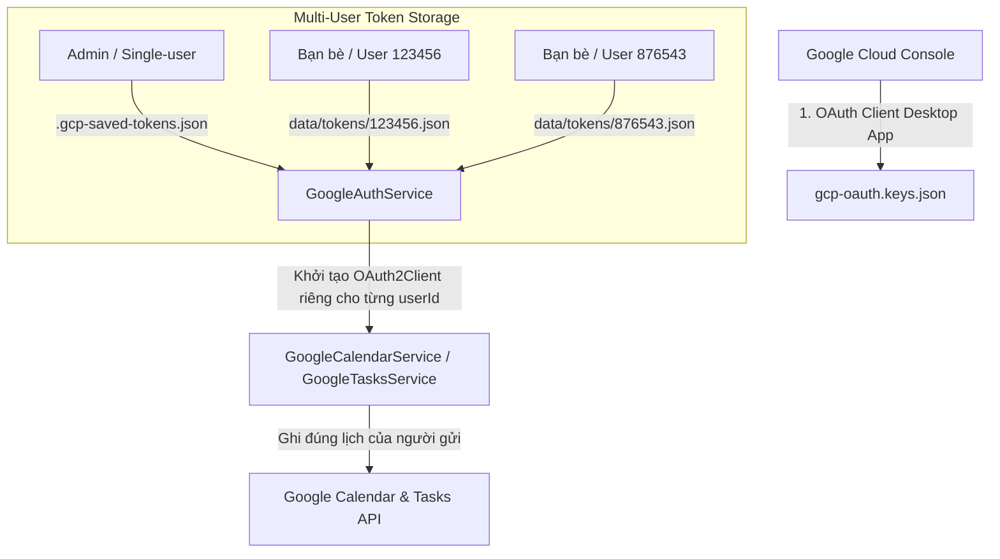

# 📅 Tích Hợp Google Workspace & Cô Lập Dữ Liệu Đa Người Dùng (OAuth2)

Tài liệu này mô tả chi tiết cách thức xác thực Google OAuth 2.0 theo từng người dùng độc lập, kiến trúc các service tích hợp **Google Calendar**, **Google Tasks** và hướng dẫn mở rộng sang các dịch vụ khác của Google Workspace (Gmail, Drive, Sheets...).

---

## 1. Vòng Đời Google OAuth 2.0 & Cô Lập Token

Ứng dụng hỗ trợ mô hình **Multi-Tenant Token Isolation** (Mỗi người dùng lưu một file Token riêng):



### Các File & Thư Mục Cấu Hình Quan Trọng:
1. `gcp-oauth.keys.json`: File chứa `client_id` và `client_secret` tải về từ Google Cloud Console.
2. `data/tokens/<telegramUserId>.json`: Lưu Token OAuth của từng người dùng Telegram.
3. `.gcp-saved-tokens.json`: Token mặc định của Admin (hoặc single-user mode).

---

## 2. Luồng Đăng Nhập Cho Người Dùng Mới (`/login` & `/code`)

1. Người dùng gõ `/login` hoặc bấm nút **"🔗 Đăng nhập Google"** trên Telegram.
2. `GoogleAuthService.generateAuthUrl(userId)` sinh URL xác thực Google với tham số `state: userId`.
3. Người dùng đăng nhập Gmail (đã nằm trong danh sách **Test Users**) và bấm **Cho phép (Allow)**.
4. Trình duyệt hiển thị mã xác thực (Authorization Code).
5. Người dùng gửi mã cho bot:
   ```text
   /code 4/0AQ...
   ```
6. Bot tự động trao đổi mã lấy `access_token` & `refresh_token`, lưu an toàn vào `data/tokens/<userId>.json`.

---

## 3. Dịch Vụ Google Calendar (`GoogleCalendarService`)

File vị trí: [`src/google/google-calendar.service.ts`](file:///Users/datdoan/Documents/projects/telebot/src/google/google-calendar.service.ts).

### Các Phương Thức Nhận `userId`:
- `listEvents(options, userId?)`: Liệt kê sự kiện trong Calendar của đúng người gửi.
- `createEvent(options, userId?)`: Tạo sự kiện mới kèm 4 mốc chuông `[60p, 30p, 10p, 0p]` vào đúng Calendar của người gửi.
- `deleteEvent(eventId, userId?)`: Xóa sự kiện.
- `getEvent(eventId, userId?)`: Lấy chi tiết sự kiện.

---

## 4. Dịch Vụ Google Tasks (`GoogleTasksService`)

File vị trí: [`src/google/google-tasks.service.ts`](file:///Users/datdoan/Documents/projects/telebot/src/google/google-tasks.service.ts).

### Các Phương Thức Nhận `userId`:
- `listTasks(options, userId?)`: Lấy danh sách việc cần làm từ `@default` tasklist của đúng người gửi.
- `createTask(options, userId?)`: Tạo to-do mới có deadline vào Tasks của đúng người gửi.
- `completeTask(taskId, taskListId?, userId?)`: Đánh dấu hoàn thành task.
- `deleteTask(taskId, taskListId?, userId?)`: Xóa task.

---

## 5. Hướng Dẫn Mở Rộng Thêm Dịch Vụ Mới (Gmail, Drive)

1. **Bật API** trên Google Cloud Console Library.
2. **Khai báo Scope** trong `src/google/google-auth.service.ts` và `scripts/auth.ts`.
3. **Tạo Service** trong `src/google/` và inject `GoogleAuthService`.
4. Gọi `this.authService.getOAuth2Client(userId)` để tương tác API Google tương ứng cho từng người dùng.
