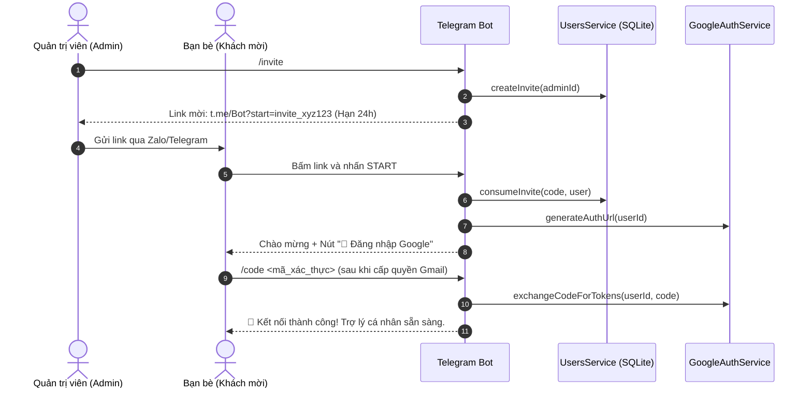

# 💬 Giao Diện Telegram Bot & Hệ Thống Đa Người Dùng (Multi-User & UX)

Tài liệu này giải thích chi tiết tầng giao tiếp Telegram (`TelegramModule`, `TelegramUpdate`), hệ thống xác thực mời người dùng qua Deep Link, các Slash Commands tiện ích, chống spam và tối ưu trải nghiệm (UX).

---

## 1. Tầng Telegram Bot (`TelegramModule`)

Dự án sử dụng thư viện `nestjs-telegraf` kết hợp với `UsersModule` (SQLite Database) và `GoogleModule` để cung cấp môi trường trợ lý đa người dùng độc lập:

- Module: `src/telegram/telegram.module.ts`
- Handler & Controller: `src/telegram/telegram.update.ts`
- Guard: `src/telegram/guards/auth.guard.ts`

---

## 2. Quy Trình Mời Người Dùng & Kích Hoạt (Deep Link Invitation)

Để cho phép bạn bè/người thân sử dụng bot mà không cần sửa file `.env` hay restart server:

---

## 3. Hệ Thống Slash Commands Đầy Đủ

### 👥 Dành Cho Mọi Người Dùng:

| Lệnh                   | Handler                       | Chức Năng                                                                                                      |
| ---------------------- | ----------------------------- | -------------------------------------------------------------------------------------------------------------- |
| `/start`               | `@Start()`                    | Khởi động bot, xử lý link kích hoạt mời (`/start invite_...`) hoặc kết nối Google tự động 1-click.             |
| `/login`, `/auth`      | `@Command('login')`           | Gửi link OAuth cá nhân kèm nút bấm Inline để đổi hoặc kết nối lại tài khoản Google.                            |
| `/status`              | `@Command('status')`          | Kiểm tra thông tin tài khoản, vai trò và tình trạng kết nối Google Workspace.                                  |
| `/today`               | `@Command('today')`           | Kích hoạt AI tổng hợp toàn bộ lịch hẹn & to-do trong ngày hôm nay của người gửi.                               |
| `/week`                | `@Command('week')`            | Kích hoạt AI tổng hợp lịch trình và việc cần làm 7 ngày tới của người gửi.                                     |
| `/calendar <nội dung>` | `@Command('calendar')`        | Lên lịch hẹn nhanh vào Calendar riêng của người gửi.                                                           |
| `/task <nội dung>`     | `@Command('task')`            | Tạo to-do nhanh vào Tasks riêng của người gửi.                                                                 |
| `/help`                | `@Help()`, `@Command('help')` | Xem hướng dẫn tương tác chi tiết và cùng menu inline với `/start`; nút **Xem báo cáo** mở Dashboard trực tiếp. |

### 👑 Dành Riêng Cho Quản Trị Viên (Admin):

| Lệnh                 | Handler              | Chức Năng                                                                              |
| -------------------- | -------------------- | -------------------------------------------------------------------------------------- |
| `/invite`            | `@Command('invite')` | Sinh link mời 1 lần (dùng trong 24h) để gửi cho bạn bè/đồng nghiệp (hoặc nhắn cho AI). |
| `/users`             | `@Command('users')`  | Xem danh sách toàn bộ người dùng trong hệ thống và trạng thái kết nối Google.          |
| `/ban <telegram_id>` | `@Command('ban')`    | Thu hồi quyền sử dụng ngay lập tức và hủy toàn bộ Token Google của một Telegram ID.    |

---

## 4. Bảo Vệ Truy Cập & Chống Spam (`AuthGuard`)

Tất cả tin nhắn gửi đến bot đều được kiểm soát bởi `AuthGuard`:

1. **Kiểm tra Whitelist**: Chỉ những ai đã nằm trong danh sách hoặc kích hoạt bằng link mời mới được phép nhắn tin.
2. **Chống Spam (Cooldown 2s)**: Ngăn chặn người dùng xả tin nhắn liên tục (dưới 2 giây).

---

## 5. Tối Ưu Trải Nghiệm Người Dùng (UX)

### 1. Trạng thái "Đang soạn tin..." liên tục (`withTyping`)

Telegram tự động tắt trạng thái `typing` sau 5 giây. Hàm `withTyping` tự động gửi action `typing` lặp lại mỗi **4 giây** bằng `setInterval` cho đến khi toàn bộ tác vụ của Gemini và Google hoàn tất.

### 2. Gửi phản hồi an toàn & Chia nhỏ tin nhắn (`sendSafeReply`)

- Tự động chia nhỏ tin nhắn dài vượt quá giới hạn 4000 ký tự của Telegram.
- Chuẩn hóa Markdown do AI tạo trước khi gửi: giải mã HTML entity và bỏ escape thừa trong URL, nên chuỗi như ` ` không hiển thị nguyên văn trong chat.
- Tự động fallback về plain-text nếu cú pháp Markdown vẫn bị lỗi ký tự đặc biệt.

### 3. Voice-to-text cục bộ

Voice Telegram được chuyển thành text bởi `whisper.cpp` trong container, không dùng API key. Bot luôn hiển thị transcript với nút **Xác nhận**, **Sửa bằng text** và **Hủy** trước khi gửi nội dung sang Gemini. Xem cấu hình và cách xử lý sự cố tại [hướng dẫn voice](../.agents/docs/global/voice-transcription.md).
