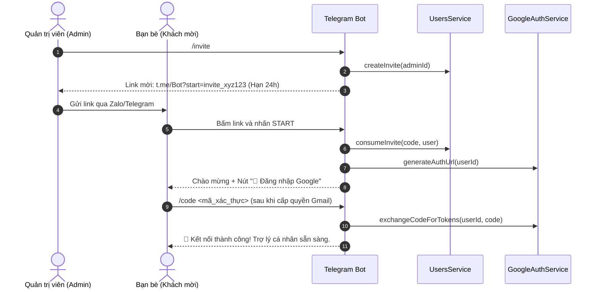

# 💬 Giao Diện Telegram Bot & Hệ Thống Đa Người Dùng (Multi-User & UX)

Tài liệu này giải thích chi tiết tầng giao tiếp Telegram (`TelegramModule`, `TelegramUpdate`), hệ thống xác thực mời người dùng qua Deep Link, các Slash Commands tiện ích, bảo vệ Rate Limit và tối ưu trải nghiệm (UX).

---

## 1. Tầng Telegram Bot (`TelegramModule`)

Dự án sử dụng thư viện `nestjs-telegraf` kết hợp với `UsersModule` và `GoogleModule` để cung cấp môi trường trợ lý đa người dùng độc lập:
- Module: [`src/telegram/telegram.module.ts`](file:///Users/datdoan/Documents/projects/telebot/src/telegram/telegram.module.ts)
- Handler & Controller: [`src/telegram/telegram.update.ts`](file:///Users/datdoan/Documents/projects/telebot/src/telegram/telegram.update.ts)
- Guard: [`src/telegram/guards/auth.guard.ts`](file:///Users/datdoan/Documents/projects/telebot/src/telegram/guards/auth.guard.ts)

---

## 2. Quy Trình Mời Người Dùng & Kích Hoạt (Deep Link Invitation)

Để cho phép bạn bè/người thân sử dụng bot mà không cần sửa file `.env` hay restart server:

---

## 3. Hệ Thống Slash Commands Đầy Đủ

### 👥 Dành Cho Mọi Người Dùng:
| Lệnh | Handler | Chức Năng |
| :--- | :--- | :--- |
| `/start` | `@Start()` | Khởi động bot, xử lý link kích hoạt mời (`/start invite_...`) hoặc hướng dẫn kết nối Google. |
| `/login`, `/auth` | `@Command('login')` | Gửi link OAuth cá nhân kèm nút bấm Inline để đăng nhập tài khoản Google. |
| `/code <mã>` | `@Command('code')` | Nhập mã xác thực Google trả về từ trình duyệt để kích hoạt Calendar & Tasks. |
| `/status`, `/usage` | `@Command('usage')` | Xem thống kê số lượng tin nhắn đã dùng trong ngày, hạn mức còn lại và tình trạng Google. |
| `/today` | `@Command('today')` | Kích hoạt AI tổng hợp toàn bộ lịch hẹn & to-do trong ngày hôm nay của người gửi. |
| `/week` | `@Command('week')` | Kích hoạt AI tổng hợp lịch trình và việc cần làm 7 ngày tới của người gửi. |
| `/calendar <nội dung>` | `@Command('calendar')` | Lên lịch hẹn nhanh vào Calendar riêng của người gửi. |
| `/task <nội dung>` | `@Command('task')` | Tạo to-do nhanh vào Tasks riêng của người gửi. |
| `/help` | `@Help()`, `@Command('help')` | Xem hướng dẫn tương tác chi tiết. |

### 👑 Dành Riêng Cho Quản Trị Viên (Admin):
| Lệnh | Handler | Chức Năng |
| :--- | :--- | :--- |
| `/invite` | `@Command('invite')` | Sinh link mời 1 lần (dùng trong 24h) để gửi cho bạn bè/đồng nghiệp. |
| `/users` | `@Command('users')` | Xem danh sách toàn bộ người dùng trong hệ thống, trạng thái Google và số lượt dùng hôm nay. |
| `/allow <telegram_id>` | `@Command('allow')` | Mở khóa trực tiếp cho một Telegram ID mà không cần link mời. |
| `/ban <telegram_id>` | `@Command('ban')` | Thu hồi quyền sử dụng ngay lập tức của một Telegram ID. |

---

## 4. Cơ Chế Chống Rate Limit & Quản Lý Quota (`AuthGuard`)

Tất cả tin nhắn gửi đến bot đều được kiểm soát bởi `AuthGuard`:
1. **Kiểm tra Whitelist**: Chỉ những ai đã nằm trong danh sách hoặc kích hoạt bằng link mời mới được phép nhắn tin.
2. **Chống Spam (Cooldown 2s)**: Ngăn chặn người dùng xả tin nhắn liên tục (dưới 2 giây).
3. **Phân Bổ Hạn Mức Ngày (Fair-use Daily Limit)**:
   - **Admin**: 500 lượt/ngày.
   - **Khách mời (Members)**: 100 lượt/ngày.
   - *Tự động làm mới vào 07:00 sáng mỗi ngày.*

---

## 5. Tối Ưu Trải Nghiệm Người Dùng (UX)

### 1. Trạng thái "Đang soạn tin..." liên tục (`withTyping`)
Telegram tự động tắt trạng thái `typing` sau 5 giây. Hàm `withTyping` tự động gửi action `typing` lặp lại mỗi **4 giây** bằng `setInterval` cho đến khi toàn bộ tác vụ của Gemini và Google hoàn tất.

### 2. Gửi phản hồi an toàn & Chia nhỏ tin nhắn (`sendSafeReply`)
- Tự động chia nhỏ tin nhắn dài vượt quá giới hạn 4000 ký tự của Telegram.
- Tự động fallback về plain-text nếu cú pháp Markdown của AI bị lỗi ký tự đặc biệt.
